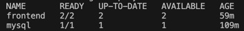
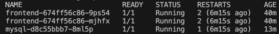
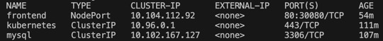
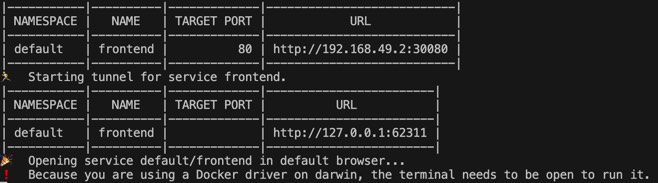
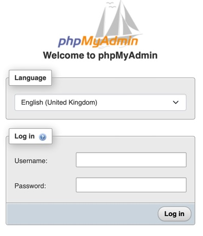
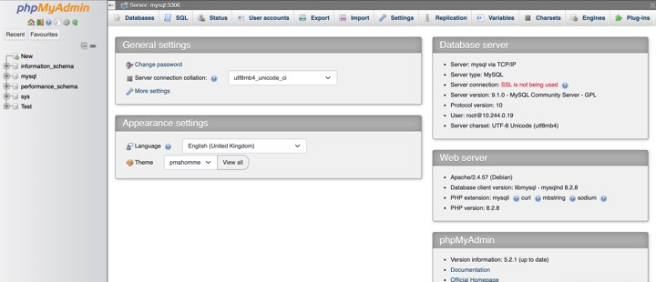

# Déploiement d'une application full stack

## Étape 1 - Prérequis
Assurez-vous d'avoir **Minikube**, **Docker** et **kubectl** installés.

1. **Installer Docker** : Kubernetes utilise Docker pour gérer les conteneurs.  
   Sur Ubuntu :  
   ```bash
   sudo apt-get update
   sudo apt-get install docker.io
   ```

2. **Installer kubectl** : C'est l'outil de ligne de commande pour interagir avec le cluster Kubernetes.  
   Sur Ubuntu :  
   ```bash
   curl -LO https://dl.k8s.io/release/v1.26.0/bin/linux/amd64/kubectl
   chmod +x kubectl
   sudo mv kubectl /usr/local/bin/
   ```

3. **Installer Minikube** : C'est un outil qui permet de créer un cluster Kubernetes localement.  
   Sur Ubuntu :  
   ```bash
   curl -Lo minikube https://storage.googleapis.com/minikube/releases/latest/minikube-linux-amd64
   sudo install minikube /usr/local/bin/
   ```


## Étape 2 - Déploiement de la BDD

1. **Déploiement de la base de données** :  
     Créez un fichier `mysql-deployment.yaml` :
   ```yaml
    apiVersion: apps/v1
    kind: Deployment
    metadata:
      name: mysql
    spec:
      replicas: 1
      selector:
        matchLabels:
          app: mysql
      template:
        metadata:
          labels:
            app: mysql
        spec:
          containers:
          - name: mysql
            image: mysql:latest
            env:
            - name: MYSQL_ROOT_PASSWORD
              value: "password"
            ports:
            - containerPort: 3306
   ```
   Appliquez le déploiement :  
   ```bash
   kubectl apply -f mysql-deployment.yaml
   ```

2. **Service MySQL** :  
   Créez un fichier `mysql-service.yaml` :
   ```yaml
    apiVersion: v1
    kind: Service
    metadata:
      name: mysql
    spec:
      ports:
        - port: 3306
      selector:
        app: mysql
   ```
   Appliquez le service :  
   ```bash
   kubectl apply -f mysql-service.yaml
   ```

## Étape 3 - Déployer une application frontend

1. **Choix du frontend** :
Vous pouvez choisir n'importe qu'elle image docker pour votre front, dans notre cas, nous choisissons une image phpmyadmin afin de mettre en avant le lien entre notre front et notre BDD.

2. **Déploiement du frontend** :  
   Créez un fichier `frontend-deployment.yaml` :
   ```yaml
    apiVersion: apps/v1
    kind: Deployment
    metadata:
      name: frontend
    spec:
      replicas: 2
      selector:
        matchLabels:
          app: frontend
      template:
        metadata:
          labels:
            app: frontend
        spec:
          containers:
            - name: frontend
              image: phpmyadmin/phpmyadmin
              ports:
                - containerPort: 80
              env:
                - name: PMA_HOST
                  value: mysql
                - name: PMA_PORT
                  value: "3306"
                - name: PMD_USER
                  value: "root" 
                - name: MYSQL_ROOT_PASSWORD
                  value: "password"
   ```  
   Appliquez le déploiement :  
   ```bash
   kubectl apply -f frontend-deployment.yaml
   ```

3. **Service Frontend** :  
   Créez un fichier `frontend-service.yaml` :
   ```yaml
    apiVersion: v1
    kind: Service
    metadata:
      name: frontend
    spec:
      type: NodePort
      selector:
        app: frontend
      ports:
      - protocol: TCP
        port: 80
        targetPort: 80
        nodePort: 30080
   ```
   Appliquez le service :  
   ```bash
   kubectl apply -f frontend-service.yaml
   ```

## Étape 4 - Volumes persistants
Pour que la base de données conserve ses données même après un redémarrage, nous utiliserons un volume persistant.

1. **Créer un PersistentVolumeClaim** :  
   Créez un fichier `mysql-pvc.yaml` :
   ```yaml
    apiVersion: v1
    kind: PersistentVolumeClaim
    metadata:
      name: mysql-pvc
    spec:
      accessModes:
        - ReadWriteOnce
    resources:
      requests:
        storage: 1Gi
   ```
   Appliquez le PVC :  
   ```bash
   kubectl apply -f mysql-pvc.yaml
   ```

2. **Modifiez le fichier `mysql-deployment.yaml` pour ajouter le volume** :  
   Ajoutez le volume et le montage dans le fichier `mysql-deployment.yaml` :
   ```yaml
    ...
    spec:
      containers:
      ...
        volumeMounts:
        - name: mysql-persistent-storage
          mountPath: /var/lib/mysql
      volumes:
      - name: mysql-persistent-storage
        persistentVolumeClaim:
          claimName: mysql-pvc
   ```
   Appliquez les modifications :  
   ```bash
   kubectl apply -f mysql-deployment.yaml
   ```

## Étape 5 - Vérifications et Accès à l'application
1. **Vérifier les déploiements** :  
   Pour vous assurer que tous les déploiements ont été créés correctement, exécutez la commande suivante :
   ```bash
   kubectl get deployments
   ```
   Cette commande doit afficher une liste des déploiements actifs, y compris ceux de `mysql` et du `frontend`.

   

2. **Vérifier les pods** :  
   Vérifiez que tous les pods sont en cours d'exécution et sans erreur en utilisant la commande suivante :
   ```bash
   kubectl get pods
   ```
   Vous devriez voir des pods pour le `mysql` et le `frontend`, tous dans un état `Running`.

   

3. **Vérifier les services** :  
   Pour vérifier que les services ont été correctement exposés, utilisez cette commande :
   ```bash
   kubectl get services
   ```
   Vous verrez les services associés au `mysql` et au `frontend`, ainsi que leurs ports.

   

4. **Accéder au frontend** :  
   Une fois le déploiement et les services confirmés, accédez à l'application frontend en exécutant la commande suivante permettant également d'obtenir l'URL de service :
   ```bash
   minikube service frontend
   ```
   Cela ouvrira l'interface phpMyAdmin dans votre navigateur. Vérifiez que vous pouvez accéder à l'application et interagir avec la base de données MySQL.

   
   
   

## Étape 6 - Nettoyage

**Supprimez les ressources créées** :
```bash
kubectl delete -f frontend-service.yaml
kubectl delete -f frontend-deployment.yaml
kubectl delete -f mysql-service.yaml
kubectl delete -f mysql-deployment.yaml
kubectl delete -f mysql-pvc.yaml
```

**Arrêtez Minikube** :
```bash
minikube stop
```

